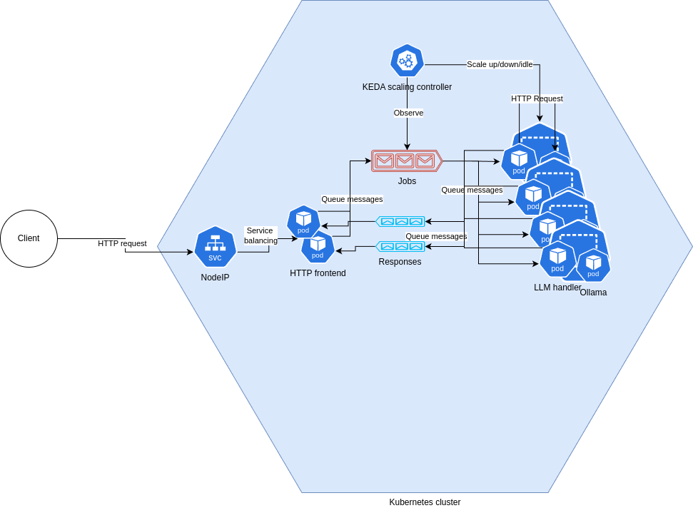

# ScaleLm

## Overview
An autoscaling deployment for serving LLM requests. Configured for very small deployment footprint.



Requests are routed to a http frontend via a node port service. This http frontend then forwards the request on to a rabbitmq jobs queue. These jobs are pulled off the queue by "llm_handler" containers, in pods alongside a single ollama container. These llm_handlers then forward the request down to the ollama container, and send the response back to the http frontend via a dedicated response queue. Finally, the http frontend container will respond to the original http request with the llm's generated text.

Scaling uses keda and is based on the length of the jobs queue, including the requests still in flight.

## Setup
- Create a kubernetes cluster.
- Install [rust](https://doc.rust-lang.org/cargo/getting-started/installation.html) and [docker](https://www.docker.com/) build tools.
- Install [kubectl](https://kubernetes.io/docs/tasks/tools/#kubectl) and [helm](https://helm.sh/docs/intro/quickstart/).
- Adjust `values.yaml` to your liking. Particularly the autoscaling and llm resources values.
- If using minikube for the cluster, run `build_and_install` from the repository root to build all containers, load them into the minikube container daemon, and install required helm charts.
- Otherwise, run through the commands in the `build_and_install` script manually.
  - `docker build commands` are fine as is.
  - `minikube image load` will need to be replaced with a docker tag and push to a repository accessible to the kubernetes cluster.
    - Note. Image identifiers in `helm/values.yaml` will need to be updated to match the chosen repository.
  - `helm install` commands are again fine as is.

## Using
- The only available api is
```
POST http://<cluster_ip>/api/generate
{
    "prompt": "<prompt>"
}
```
- This will return the response generated by the backend llm in a single JSON blob
```
{
    "Success": {
        "response": "<response>",
        "duration": "<duration as ns>"
    }
}
or
{
    "Error": "<error text>"
}
```

## Components in detail
### RabbitMQ cluster
Nothing special here. A RabbitMQ cluster is deployed to allow for creating message queues between the http frontend and the LLMs backend.

I used a cluster size of 3 to ensure there's no service-wide outage in the case of a failure (and RabbitMQ guidance is to never use a cluster size of 2).

### KEDA scaler
Again, nothing special here. Scale up the LLM pods based on the number of jobs in flight. To minimise waiting time, this is currently set to aim for 1 pod for each request in progress, but can be modified in values.yaml

### HTTP frontend
Component setup involves creating a binding on the jobs queue in the RabbitMQ cluster, setting up a consumer on an exclusive response queue, and opening up an axum router for handling requests.

The consumer has access to a hash map of requests which are waiting for respones, containing tokio::oneshot channel senders. When the consumer receives a message on the queue, it checks to see if the message matches any of the outstanding requests. If so, the response in the message is sent along that oneshot channel.

The axum router accepts requests through the NodePort service. Requests are sent along the jobs queue and the request handler function then awaits a response via the queue consumer. Responds to the requestor after a successful response or a timeout.

### LLM handler
Simple layer in the same pod as the LLM container.

Registers as a consumer on the jobs queue, with a limit of 1 message at a time. So if more pods get spun up before we're ready to handle another job, they can take it.

Forwards requests from the jobs queue on to the local LLM container. Responds to the relevant HTTP frontend via its response queue upon receiving a successful response.

### Ollama container
To make spin-up time as quick as possible, I use a modified ollama container which has already pulled the required model, meaning there is no need to do an explicit pull at startup, and the model is just loaded from the image, rather than needing to be fetched from the internet.

Otherwise, acts the same as any other [Ollama](https://github.com/ollama/ollama/blob/main/docs/api.md#list-running-models) container.

## Limitations
I would have liked to solve all these problems, but I'm out of time for this project.
- No TLS
- No response streaming (just a single HTTP response)
- No graceful scale down
- Logging + error messages could be nicer
- No useful pod healthchecking
- No automated testing
- Errors in the backend don't send anything to the frontend, which just fails on timeout
- No retrys on failed attempts to handle queue messages
- RabbitMQ credentials are plaintext in the values.yaml
- No scaling of nodes, so scaling down doesn't currently conserve physical resources
- Better declaration/handling of required config for rust binaries
- Could neaten up dependencies for smaller binaries (currently both rust binaries include all the dependencies used by either binary)
- Could shrink container sizes using a slimmer base rust image
